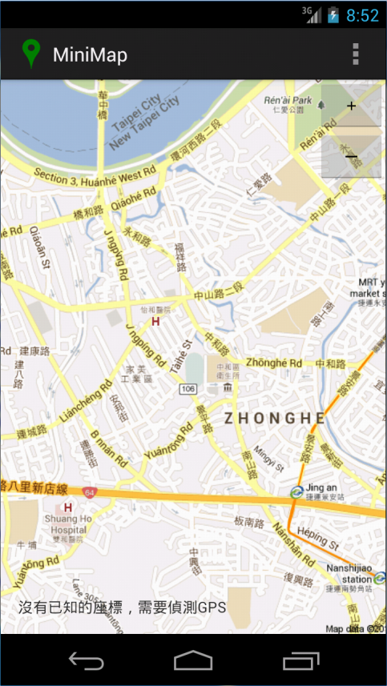

tutorial-minimap
================
Example static GPS-enabled map project in Computer Science summer lesson, Taipei Municipal Chenggong Senior High School class of giftedness.

### Screenshot

Released under MIT License.
